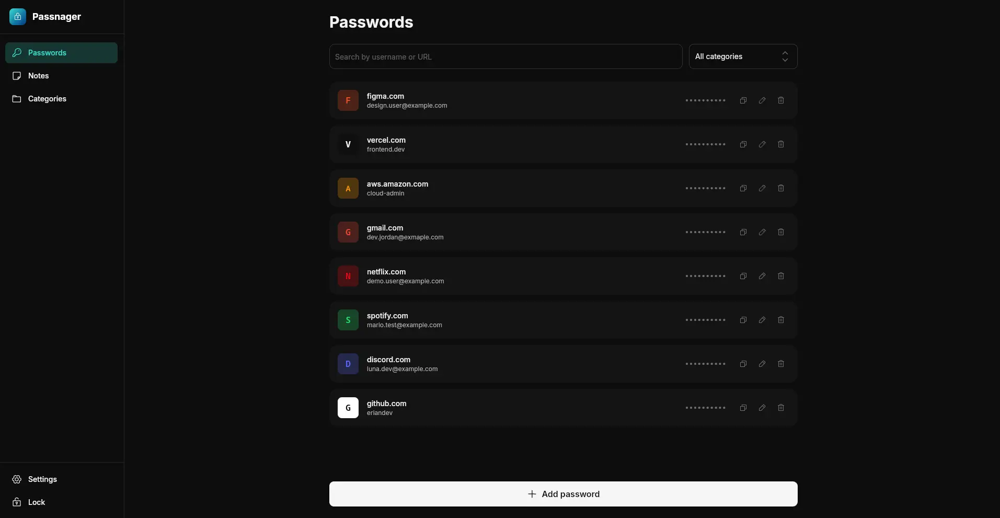

<h1 align="center">
  🔐 Passnager (name suggestions welcome)
</h1>

<p align="center">
  <strong>A simple, private and local-first password manager.</strong>
</p>

<p align="center">
  Your passwords. Your device. Your data.
</p>

<p align="center">
  
  
  
  
</p>

---

## ✨ About

**Passnager** is a desktop password and notes manager focused on privacy, simplicity and local data ownership.

Your vault (passwords and notes alike) is stored locally on your device and protected with modern cryptographic primitives, without requiring a cloud account or remote server.

The project is built with **SvelteKit + Tauri 2**, combining a modern web UI with a lightweight native desktop application.

## ⭐ Features

- **Passwords** — store, search and copy login credentials from an easy-to-browse list.
- **Encrypted notes** — free-form notes encrypted at rest, organised with colours and categories.
- **Categories** — colour-coded groups that keep the vault tidy.
- **Session lock** — nothing in the vault is reachable while locked; the master password opens it.
- **Clipboard** — copy a decrypted value straight to the clipboard.

## 🖥️ Preview

<p align="center">
  
</p>

## 🔐 Security

Passnager follows a local-first security model.

Sensitive vault data is encrypted before being persisted locally using:

| Component        | Purpose                               |
| ---------------- | ------------------------------------- |
| **Argon2id**     | Password-based key derivation         |
| **AES-256-GCM**  | Authenticated encryption              |
| **Random nonce** | Unique nonce per encryption operation |
| **SQLite**       | Local persistent storage              |

All vault access (passwords, notes and categories) is routed through the unlocked session, so nothing can be read or written while the vault is locked. Encrypted content is decrypted on demand rather than cached in memory, and the database schema validates stored values (colour format, note length) before they are written.

The application does not require your vault to be stored on a remote server, and it never phones home either: fonts are self-hosted, password cards render locally-generated initial avatars instead of fetching third-party favicons, and a strict Content Security Policy blocks every remote origin (in dev and release builds alike).

> [!WARNING]  
> Passnager is currently under active development and has **not been independently security audited**.
> Do not rely on it for critical secrets until you have reviewed the implementation and accepted the associated risks.

### 📝 Logging

Logs help explain failures without guessing:

- **Development builds** print log entries to the terminal as they happen.
- **Release builds** write to `passnager.log` in the app's config directory, next to the vault file.

When a release build fails to start, nothing you hold (a password, a note or a category) has been read or written — the log records the reason it refused to launch instead.

## 🛠️ Tech Stack

**Frontend**

- Svelte
- SvelteKit
- TypeScript

**Desktop**

- Rust
- Tauri 2

**Storage**

- SQLite

**Cryptography**

- Argon2id
- AES-256-GCM

## 🚀 Development

### Requirements

Make sure you have the required tooling for your platform:

- Node.js
- pnpm
- Rust
- Tauri system dependencies

### Clone

```bash
git clone https://github.com/eriandev/passnager.git
cd passnager
```

### Install dependencies

```bash
pnpm install
```

### Start development

```bash
pnpm tauri dev
```

### Build for Linux

```bash
pnpm tauri:build:linux
```

### Build Windows

```bash
pnpm tauri:build:windows
```

## 📦 Releases

Official builds are published through GitHub Releases.

Supported targets currently include:

- 🐧 Linux — x86_64
- 🪟 Windows — x86_64

Release builds are generated automatically through GitHub Actions.

## 🗺️ Roadmap

- [x] Password categories
- [x] Encrypted notes
- [ ] Password generator
- [ ] Password strength analysis
- [ ] Import / export
- [ ] Automatic vault locking
- [ ] Window state persistence
- [ ] Automatic updates

## 🤝 Contributing

Contributions, suggestions and bug reports are welcome.

Before opening a pull request, please make sure your changes are tested locally and follow the existing project conventions.

## 📄 License

Passnager is open source software licensed under the **MIT License**.

See [`LICENSE`](LICENSE) for the full license text.

---

<p align="center">
  Built with ❤️ by <a href="https://github.com/eriandev">eriandev</a>
</p>
